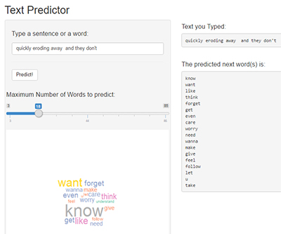

## Problem. 

* People spends a lot of time typing on their mobile devices. Although mobile devices's keyboard sizes and functions has been considerably improved; typing on mobile devices can be a serious pain. So,

* The next time, that a mobile device user writes, the three next words, needs to be predicted

### Data
* The dataset uses three files named:
    + **en_US.blogs.txt** (205 Mb of blogs texts)
    + **en_US.news.txt** (200 Mb of news texts)
    + **en_US.twitter.txt** (163 Mb of twits)

--- .class #ddesc1 

## Preprocessing.  

### Preprocessing  
A process of data cleaning was made before mining the files.

* Extra whitespace were removed.
* Numbers and punctuation signs were removed.
* English stopwords were removed.
* All text was converted to lowercase

### Sample
A clean corpus containing all text files was generated, but it was to big for the computer hardware resources, so different samples were made. Tm package was used.

Finally a 5% of the corpus was used to predict.

--- .class #ddesc2

## Algorithm. 

* There were made several document term matrixes for each word, bigrams, trigrams and quadgrams, using quanteda package. 
* For each, 4-grams, 3-grams and 2-grams, a data frame was constructed.
* [Kneser-Ney smoothing](https://en.wikipedia.org/wiki/Kneser%E2%80%93Ney_smoothing) probability (KNP) was calculated for 2-grams, 3-grams and 4-grams, and each data frame was ordered descendently, by KNP term.
* This probability was used to predict the next three words
  

--- .class #expAn1 

## Shiny App
* A [Shiny App](https://lgarciap.shinyapps.io/TextPredictor/) was made. The user introduces a sentence and can choose how many words he wants to predict. 
* A worldcloud was made to show the predicted's words frequency

